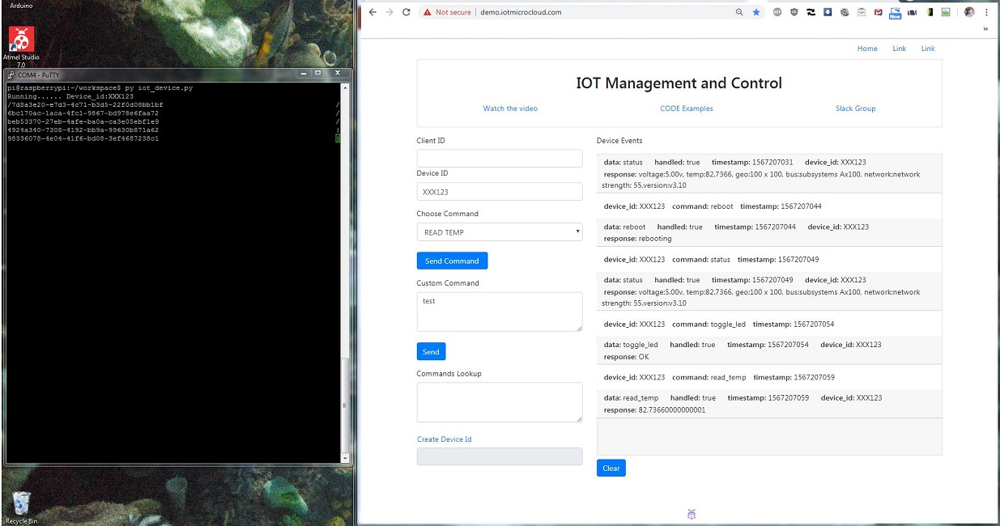

# IOT_samples

## Optional:
Download the Android IOT app
https://play.google.com/store/apps/details?id=com.iotmicrocloud
(use with config.txt)

## Step 1: Download and run the python app on your device.
1. Use the button at the bottom of the page to create a unique device ID for your device.  
2. Download and run "iot_device.py" on your internet connected RaspberryPi or Arduino.
3. Be sure to replace the default deviceID in the script with  your unique deviceID.
4. The script will now respond to commands sent to it from the IOTwebsite Demo.

## Step 2: Send commands from the IOTMC-Demo platform.
Enter your device ID into the text box.
Send one of the commands from the dropdowns, or send your own command string.
Use the IOT demo at http://demo.iotmicrocloud.com/ to send commands to your device.

Note: the mobile app can send default commands, and also be configured to send your own customized commands.
Just download the config.txt file and edit. 

App store link here:
https://play.google.com/store/apps/details?id=com.iotmicrocloud

-Profit!

