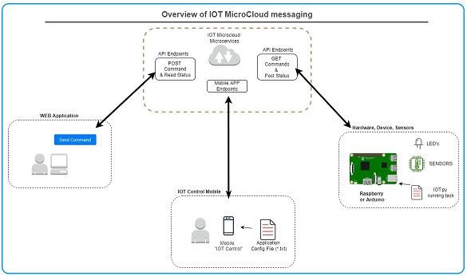

# IOT_samples 
The backend system handles user input from the Demo Website or the Android app. 
Requests are stored with your DeviceID and a timestamp.

The python "IOT" script listens for commands sent from the website, and will answer back with "OK" once its done processing the command, as well as send any information that was requested, like "temperature" or "status" info.  

# Customize the mobile interface to suit your needs.

You can  enter custom commands and in the web text box and on the mobile app, by using the config file provided.
The config file allows you to create a your own custom button layout for sending the commands you provide. 
Device response/data is shown in the app text area.

## Also, feel free to reach out with any suggestions or comments.
Reddit u/Zapeggo
  

Default test device is GA1875.  
If my Pi3 is up and running - you will get a response :)  

# TO RUN PYTHON ON RASPBERRY PI IN THE BACKGROUND AND EXIT:  
 nohup python iot.py &  
  
  
#  RASPBERRY PI QUICK START
1. Use the button at the bottom of the page to create a unique device ID for your device.  
2. Replace the default deviceID in the script with your unique deviceID (6 digits, Numbers and Letters).
3. Download and run "iot.py" on your internet connected device (RPi3).
4. Interact with your device via the IOTMicroCloud Demo website.

## Using the Demo website.  
1. Enter your device ID into the Device ID box  (leave ClientID empty).
2. Send one of the default commands, or send your own command string using the dropdowns + text box.
3. Use the IOT demo at http://demo.iotmicrocloud.com/ to send commands to your device.

## Using the Android IOT app  
* Just enter your DeviceID at the top of the app, and start sending commands.
* The app has default commands like "get temp" and "reset device" but can also be configured to send your own customized commands.
* Just edit the config.txt file and load it in-app. 

  

## Link to the app:  
https://play.google.com/store/apps/details?id=com.iotmicrocloud

-Thanks for trying it out!

